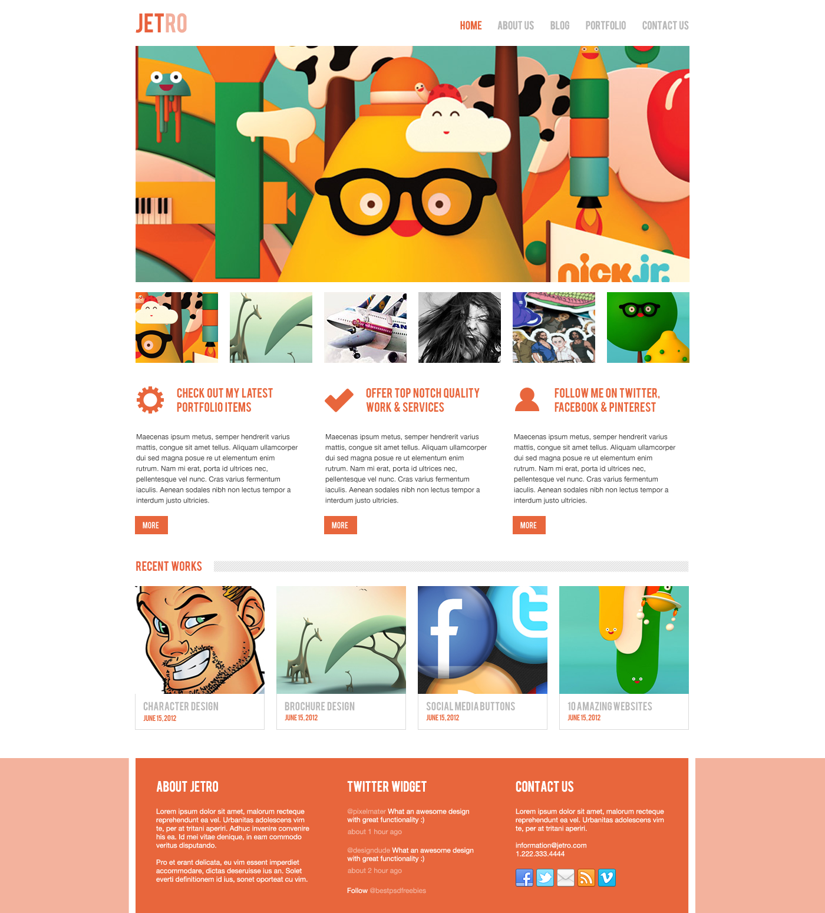

## Project overview

1. layout - Mobile First
2. container - own grid system (file - 'mixin.scss')
3. assembly - Gulp
4. SASS 
5. BEM
6. slider - Slick slider

* all interactive elements have :hover, :focus 
* validity HTML/CSS
* Semantics of layout
* Adaptive - mobile, table

"# JETRO" 
